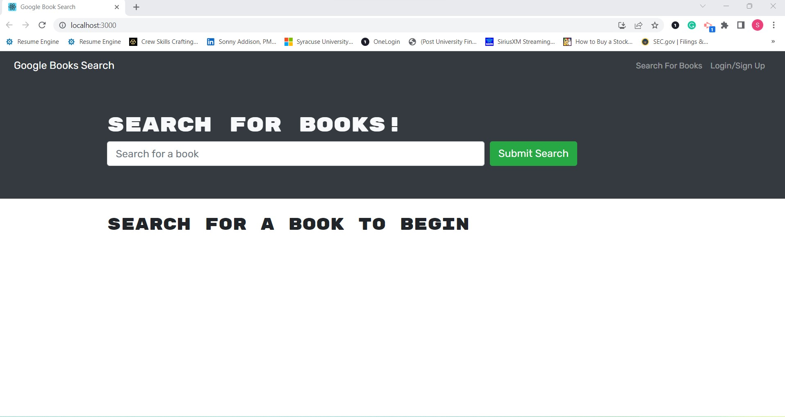
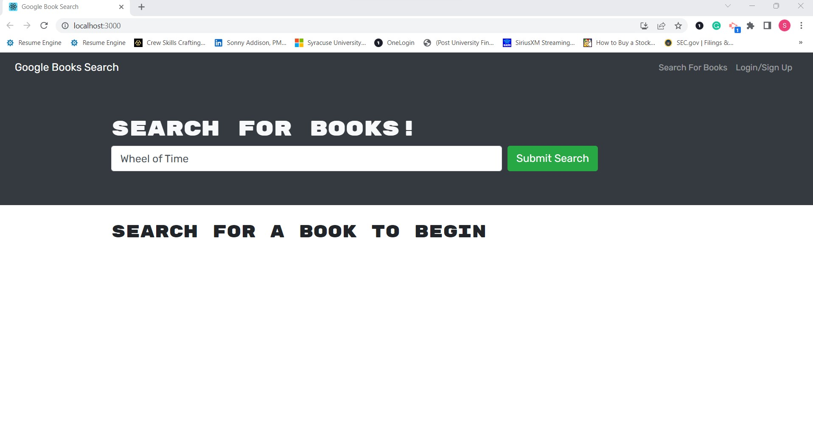
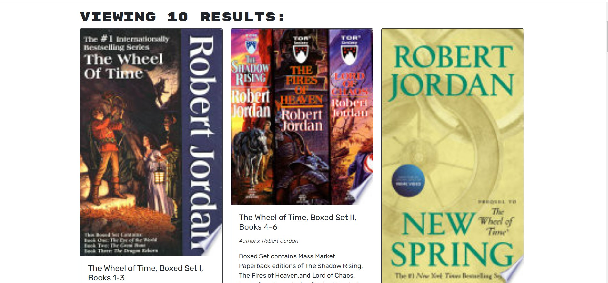

# MERNbookSearch  
 ## Description

Search application for Google Books that allows one to sign into an account and save their favoret books.
  
## User Sory

AS AN avid reader  
I WANT to search for new books to read  
SO THAT I can keep a list of books to purchase  

## Acceptance Criteria

GIVEN a book search engine  
WHEN I load the search engine  
THEN I am presented with a menu with the options Search for Books and Login/Signup and an input field to search for books and a submit button  
WHEN I click on the Search for Books menu option  
THEN I am presented with an input field to search for books and a submit button  
WHEN I am not logged in and enter a search term in the input field and click the submit button  
THEN I am presented with several search results, each featuring a book’s title, author, description, image, and a link to that book on the Google Books site  
WHEN I click on the Login/Signup menu option  
THEN a modal appears on the screen with a toggle between the option to log in or sign up  
WHEN the toggle is set to Signup  
THEN I am presented with three inputs for a username, an email address, and a password, and a signup button  
WHEN the toggle is set to Login  
THEN I am presented with two inputs for an email address and a password and login button  
WHEN I enter a valid email address and create a password and click on the signup button  
THEN my user account is created and I am logged in to the site  
WHEN I enter my account’s email address and password and click on the login button  
THEN I the modal closes and I am logged in to the site  
WHEN I am logged in to the site  
THEN the menu options change to Search for Books, an option to see my saved books, and Logout  
WHEN I am logged in and enter a search term in the input field and click the submit button  
THEN I am presented with several search results, each featuring a book’s title, author, description, image, and a link to that book on the Google Books site and a button to save a book to my account  
WHEN I click on the Save button on a book  
THEN that book’s information is saved to my account  
WHEN I click on the option to see my saved books  
THEN I am presented with all of the books I have saved to my account, each featuring the book’s title, author, description, image, and a link to that book on the Google Books site and a button to remove a book from my account  
WHEN I click on the Remove button on a book  
THEN that book is deleted from my saved books list  
WHEN I click on the Logout button  
THEN I am logged out of the site and presented with a menu with the options Search for Books and Login/Signup and an input field to search for books and a submit button    

---
## Table of Contents (Optional)

- [Installation](#installation)
- [Usage](#usage)
- [Credits](#credits)
- [License](#license)  
  
---

## Installation

To install:  
 * Clone code from Github repository 
 * Type run npm i within the intergraited terminal with your coding program within the root folder.  
 * Type npm develop to start the servers 
  
---

## Usage

  
---  
  
Landing Page   

  

---  

 Search Entry

  

---  

Search Results

  

--- 

Heroku link: https://fast-mountain-64888.herokuapp.com/

GitHub link: https://github.com/SonnyAddison/MERNbookSearch

---
## Credits

Thank you to Coding Boot Camp / Solid - Broccoli for the starter code: 
https://github.com/coding-boot-camp/solid-broccoli
  
---
## License

MIT License  

Copyright (c) 2022 Sonny Addison  

Permission is hereby granted, free of charge, to any person obtaining a copy
of this software and associated documentation files (the "Software"), to deal
in the Software without restriction, including without limitation the rights
to use, copy, modify, merge, publish, distribute, sublicense, and/or sell
copies of the Software, and to permit persons to whom the Software is
furnished to do so, subject to the following conditions:  

The above copyright notice and this permission notice shall be included in all
copies or substantial portions of the Software.  

THE SOFTWARE IS PROVIDED "AS IS", WITHOUT WARRANTY OF ANY KIND, EXPRESS OR
IMPLIED, INCLUDING BUT NOT LIMITED TO THE WARRANTIES OF MERCHANTABILITY,
FITNESS FOR A PARTICULAR PURPOSE AND NONINFRINGEMENT. IN NO EVENT SHALL THE
AUTHORS OR COPYRIGHT HOLDERS BE LIABLE FOR ANY CLAIM, DAMAGES OR OTHER
LIABILITY, WHETHER IN AN ACTION OF CONTRACT, TORT OR OTHERWISE, ARISING FROM,
OUT OF OR IN CONNECTION WITH THE SOFTWARE OR THE USE OR OTHER DEALINGS IN THE
SOFTWARE.

---

## How to Contribute

# Contributor Covenant Code of Conduct

## Our Pledge

We as members, contributors, and leaders pledge to make participation in our
community a harassment-free experience for everyone, regardless of age, body
size, visible or invisible disability, ethnicity, sex characteristics, gender
identity and expression, level of experience, education, socio-economic status,
nationality, personal appearance, race, caste, color, religion, or sexual
identity and orientation.

We pledge to act and interact in ways that contribute to an open, welcoming,
diverse, inclusive, and healthy community.

## Our Standards

Examples of behavior that contributes to a positive environment for our
community include:

* Demonstrating empathy and kindness toward other people
* Being respectful of differing opinions, viewpoints, and experiences
* Giving and gracefully accepting constructive feedback
* Accepting responsibility and apologizing to those affected by our mistakes,
  and learning from the experience
* Focusing on what is best not just for us as individuals, but for the overall
  community

Examples of unacceptable behavior include:

* The use of sexualized language or imagery, and sexual attention or advances of
  any kind
* Trolling, insulting or derogatory comments, and personal or political attacks
* Public or private harassment
* Publishing others' private information, such as a physical or email address,
  without their explicit permission
* Other conduct which could reasonably be considered inappropriate in a
  professional setting

## Enforcement Responsibilities

Community leaders are responsible for clarifying and enforcing our standards of
acceptable behavior and will take appropriate and fair corrective action in
response to any behavior that they deem inappropriate, threatening, offensive,
or harmful.

Community leaders have the right and responsibility to remove, edit, or reject
comments, commits, code, wiki edits, issues, and other contributions that are
not aligned to this Code of Conduct, and will communicate reasons for moderation
decisions when appropriate.

## Scope

This Code of Conduct applies within all community spaces, and also applies when
an individual is officially representing the community in public spaces.
Examples of representing our community include using an official e-mail address,
posting via an official social media account, or acting as an appointed
representative at an online or offline event.

## Enforcement

Instances of abusive, harassing, or otherwise unacceptable behavior may be
reported to the community leaders responsible for enforcement at
sonny.m.addison@hotmail.com.
All complaints will be reviewed and investigated promptly and fairly.

All community leaders are obligated to respect the privacy and security of the
reporter of any incident.

## Enforcement Guidelines

Community leaders will follow these Community Impact Guidelines in determining
the consequences for any action they deem in violation of this Code of Conduct:

### 1. Correction

**Community Impact**: Use of inappropriate language or other behavior deemed
unprofessional or unwelcome in the community.

**Consequence**: A private, written warning from community leaders, providing
clarity around the nature of the violation and an explanation of why the
behavior was inappropriate. A public apology may be requested.

### 2. Warning

**Community Impact**: A violation through a single incident or series of
actions.

**Consequence**: A warning with consequences for continued behavior. No
interaction with the people involved, including unsolicited interaction with
those enforcing the Code of Conduct, for a specified period of time. This
includes avoiding interactions in community spaces as well as external channels
like social media. Violating these terms may lead to a temporary or permanent
ban.

### 3. Temporary Ban

**Community Impact**: A serious violation of community standards, including
sustained inappropriate behavior.

**Consequence**: A temporary ban from any sort of interaction or public
communication with the community for a specified period of time. No public or
private interaction with the people involved, including unsolicited interaction
with those enforcing the Code of Conduct, is allowed during this period.
Violating these terms may lead to a permanent ban.

### 4. Permanent Ban

**Community Impact**: Demonstrating a pattern of violation of community
standards, including sustained inappropriate behavior, harassment of an
individual, or aggression toward or disparagement of classes of individuals.

**Consequence**: A permanent ban from any sort of public interaction within the
community.

## Attribution

This Code of Conduct is adapted from the [Contributor Covenant][homepage],
version 2.1, available at
[https://www.contributor-covenant.org/version/2/1/code_of_conduct.html][v2.1].

Community Impact Guidelines were inspired by
[Mozilla's code of conduct enforcement ladder][Mozilla CoC].

For answers to common questions about this code of conduct, see the FAQ at
[https://www.contributor-covenant.org/faq][FAQ]. Translations are available at
[https://www.contributor-covenant.org/translations][translations].

